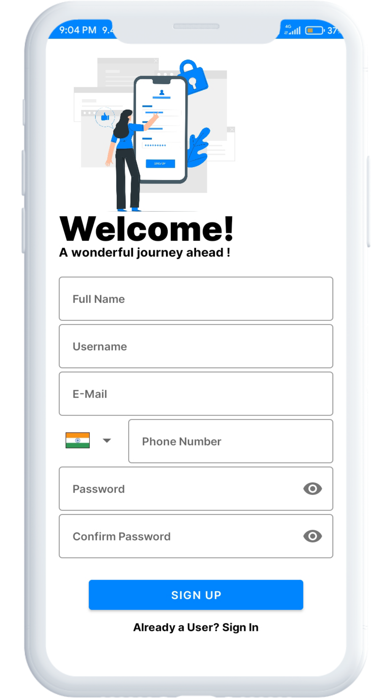
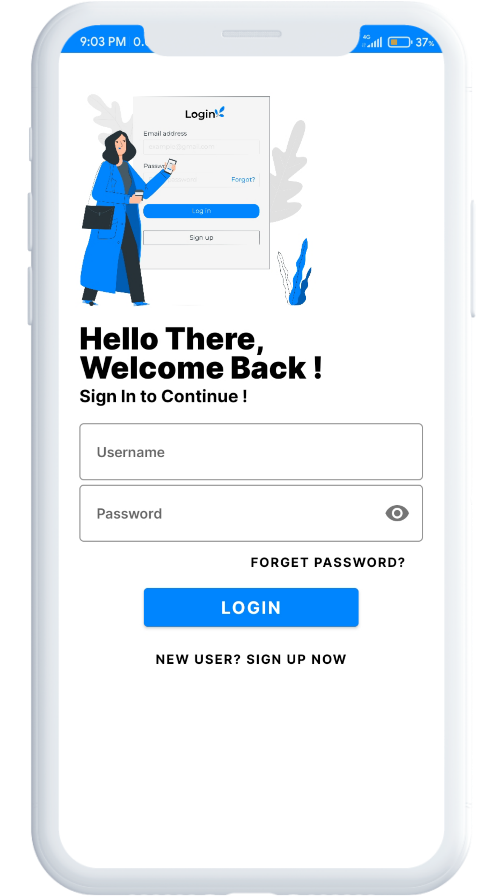
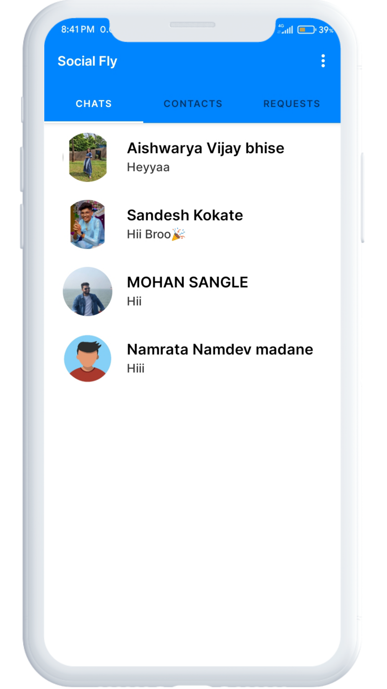
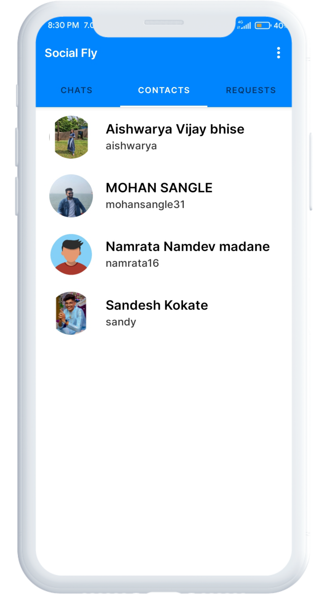
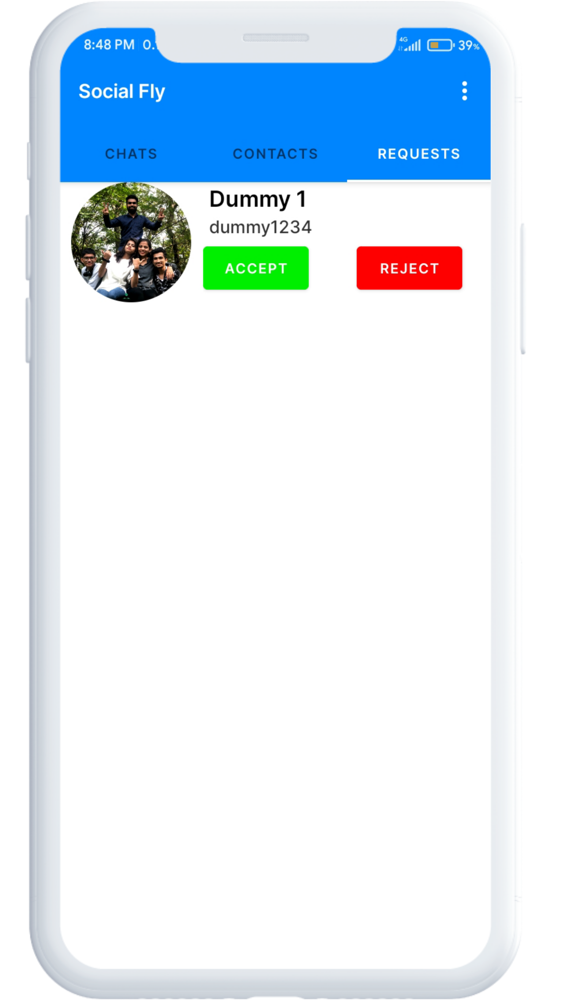

# SocialFly
Messaging apps have changed the way we communicate with each other.

We love the convenient, natural nature of it so much we happily opened our minds and personal messaging channels to conversations with businesses. It doesn't even have to be human-to-human.

Moreover, after the pandemic crisis, consumers are not so opposed to messaging automation either. All in all, the advantages of instant messaging apps marketing will be hard to ignore in 2021.

## Project Overview
Our Project <b>“Social Fly”</b> is an android application for users to instantly communicate with each other. An the most important part of building a good chat application is focus on the data flow on web and database . This project spends a good amount of research to find the most appropriate technology for deliver the data flow, which is Firebase Authentication to authenticate users, Firebase Realtime database for storing data, Firebase Storage to store documents and pictures, Firebase for text chat and Jitsi Meet for video and audio and many more.

   

   

   
